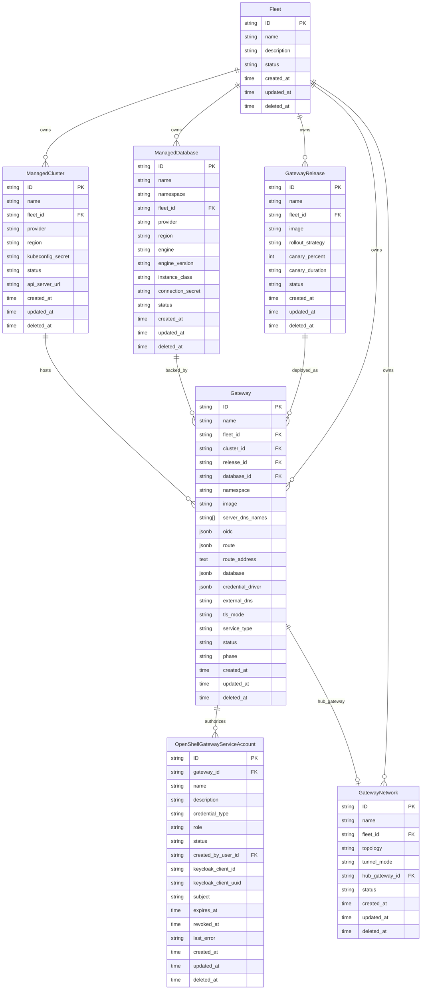

# Data Model

**Date:** 2026-08-03
**Status:** Active

## Overview

The HyperShell API server provides a control plane for deploying and managing distributed API gateways across multiple Kubernetes clusters and cloud providers.

**TODO: Sector/Fleet removal** - The model previously included a top-level "Sector" organizational unit, but this abstraction is being removed. All gateways are part of the same fleet, and there's no need to sectorize. The API currently uses "fleet" terminology (`/api/hypershell/v1/fleets`), but this entire layer will be removed in a future PR. Gateways, clusters, databases, releases, and networks will become top-level resources without fleet/sector scoping.

Current model (to be simplified):

- **Fleet** (formerly "Sector") - top-level organizational unit. Groups clusters, databases, releases, gateways, and networks. All resources belong to exactly one fleet via `fleet_id`. **This will be removed.**
- **ManagedCluster** - a Kubernetes cluster registered into a fleet. Tracks provider, region, API server URL, and a kubeconfig secret reference.
- **ManagedDatabase** - a database instance provisioned for a fleet. Tracks provider, region, engine type/version, instance class, and a connection secret reference.
- **GatewayRelease** - a versioned container image for gateway deployments within a fleet. Supports rollout strategies with canary percent/duration controls.
- **Gateway** - an API gateway instance deployed onto a specific cluster, using a specific release and database, within an API-assigned namespace. Tracks TLS mode, service type, external DNS, and lifecycle phase.
- **OpenShellGatewayServiceAccount** - a creator-bound automation identity for one Gateway. It stores an OpenShell role and non-secret Keycloak lifecycle metadata.
- **GatewayNetwork** - defines network connectivity topology between gateways in a fleet. Supports tunnel modes and designates a hub gateway for hub-and-spoke or mesh networking.

## Entity Relationship Diagram



## Requirements

### Requirement: Fleet Lifecycle

The system SHALL support creating, reading, updating, and deleting Fleets. A Fleet SHALL have a unique name, optional description, and a status field.

#### Scenario: Create Fleet
- GIVEN a valid fleet name
- WHEN a POST request is made to `/api/hypershell/v1/fleets`
- THEN a new Fleet is created with a KSUID
- AND the response includes the created Fleet

### Requirement: Fleet-Scoped Resources

All resources (ManagedCluster, ManagedDatabase, GatewayRelease, Gateway, GatewayNetwork) SHALL belong to exactly one Fleet via `fleet_id`.

#### Scenario: Create Gateway with Fleet Reference
- GIVEN a valid fleet_id, cluster_id, release_id, and database_id
- WHEN a POST request is made to `/api/hypershell/v1/gateways`
- THEN a new Gateway is created within the specified fleet
- AND the Gateway references valid cluster, release, and database resources

### Requirement: Gateway Namespace Ownership

The API server SHALL assign each Gateway an immutable Kubernetes namespace before persistence and before publishing its creation event. The namespace SHALL be `openshell-<id-hex-8>`, where `id-hex-8` is the lowercase hexadecimal encoding of 8 bytes from the Gateway KSUID's random payload, producing a 26-character namespace (e.g., `openshell-a1b2c3d4e5f67890`). This is stable, collision-safe for realistic fleet sizes (~1 in 10^9 at 1M gateways), and a valid Kubernetes DNS label. Namespace SHALL be read-only in the REST contract and SHALL be absent from REST and gRPC create and update inputs.

#### Scenario: Create Gateways Without a Namespace

- GIVEN two valid Gateway create requests that omit namespace
- WHEN the API server creates both Gateways
- THEN each response SHALL contain a non-empty namespace derived from its Gateway identifier
- AND the namespaces SHALL be distinct Kubernetes DNS labels
- AND each creation event SHALL contain the same namespace that was persisted

#### Scenario: Namespace Cannot Be Selected or Updated

- GIVEN the REST and gRPC Gateway contracts
- WHEN a client constructs a create or update request
- THEN namespace SHALL NOT be available as an input field
- AND the API-assigned namespace SHALL remain available on Gateway responses and events

### Requirement: Gateway Provisioning Fields

A Gateway SHALL include provisioning configuration fields that the control plane uses to deploy and configure the OpenShell gateway workload on a target cluster.

> **Relationship to fleet management fields:** The `image` field provides a direct image reference for the control plane reconciler, while `release_id` references a GatewayRelease for fleet-level rollout management (canary, rollback). When both are set, `release_id` takes precedence and the reconciler resolves it to an image. Similarly, `database` (JSONB) carries inline provisioning config for the reconciler, while `database_id` references a ManagedDatabase for fleet-level database lifecycle. When `database_id` is set, it takes precedence and the reconciler reads the connection details from the referenced ManagedDatabase.

| Field | Type | Description |
|---|---|---|
| `image` | string | Gateway container image reference (e.g., `ghcr.io/nvidia/openshell/gateway:21da343c9f838bd9ac85dc61bf44889de1a72873`) |
| `supervisor_image` | string | Supervisor sidecar container image (default: `ghcr.io/nvidia/openshell/supervisor:0.0.109`) |
| `server_dns_names` | string[] | DNS names for TLS certificate SANs |
| `oidc` | JSONB | OIDC authentication config: `{issuer, audience, jwks_ttl, roles_claim, admin_role, user_role, scopes_claim}` |
| `route` | JSONB | Route exposure config for GRPCRoute provisioning: `{host}` |
| `route_address` | text | Read-only external address populated by the control plane (e.g., `grpcs://hostname:443`) |
| `database` | JSONB | Database backend config: `{storageSize, image, externalSecretRef}` |
| `credential_driver` | JSONB | Credential storage driver config: `{type, kubernetes_secrets, vault}`. See [`openshell-gateway-credentials.spec.md`](./openshell-gateway-credentials.spec.md) |

See [`openshell-gateway.spec.md`](./openshell-gateway.spec.md) and its sub-specs for full provisioning details.

### Requirement: Gateway Deployment Lifecycle

A Gateway SHALL track its deployment lifecycle through the `phase` field. The `status` field SHALL reflect operational health.

#### Scenario: Gateway Phase Progression
- GIVEN a Gateway in phase "Pending"
- WHEN the control plane provisions it on the target cluster
- THEN the phase SHALL transition to "Provisioning"
- AND upon successful deployment, to "Running"

### Requirement: Canary Release Strategy

A GatewayRelease SHALL support canary deployment via `rollout_strategy`, `canary_percent`, and `canary_duration` fields.

#### Scenario: Canary Rollout
- GIVEN a GatewayRelease with `rollout_strategy: canary`, `canary_percent: 10`, `canary_duration: 30m`
- WHEN the release is deployed
- THEN 10% of traffic SHALL route to the new version
- AND after 30 minutes, the rollout SHALL proceed to full deployment

### Requirement: Network Topology

A GatewayNetwork SHALL define how gateways within a fleet communicate. The `topology` field indicates the network shape and `tunnel_mode` the encapsulation method.

#### Scenario: Hub-and-Spoke Network
- GIVEN a GatewayNetwork with `topology: hub-spoke` and a `hub_gateway_id`
- WHEN gateways join the network
- THEN all spoke gateways SHALL route through the hub gateway

## API Reference

All routes under `/api/hypershell/v1/`:

| Method | Path | Operation |
|--------|------|-----------|
| GET/POST | `/fleets` | List/Create |
| GET/PATCH/DELETE | `/fleets/{id}` | Get/Update/Delete |
| GET/POST | `/gateways` | List/Create |
| GET/PATCH/DELETE | `/gateways/{id}` | Get/Update/Delete |
| GET/POST | `/gateways/{gateway_id}/service_accounts` | List/Create gateway OpenShellGatewayServiceAccounts |
| GET/DELETE | `/gateways/{gateway_id}/service_accounts/{service_account_id}` | Get/Delete an OpenShellGatewayServiceAccount |
| POST | `/gateways/{gateway_id}/service_accounts/{service_account_id}/revoke` | Permanently revoke an OpenShellGatewayServiceAccount |
| GET/POST | `/gateway_networks` | List/Create |
| GET/PATCH/DELETE | `/gateway_networks/{id}` | Get/Update/Delete |
| GET/POST | `/gateway_releases` | List/Create |
| GET/PATCH/DELETE | `/gateway_releases/{id}` | Get/Update/Delete |
| GET/POST | `/managed_clusters` | List/Create |
| GET/PATCH/DELETE | `/managed_clusters/{id}` | Get/Update/Delete |
| GET/POST | `/managed_databases` | List/Create |
| GET/PATCH/DELETE | `/managed_databases/{id}` | Get/Update/Delete |

## CLI Reference (`hsctl`)

The `hsctl` CLI mirrors the REST API 1-for-1. Every REST operation has a corresponding command.

### API ↔ CLI Mapping

#### Fleets

**Note:** Fleet/Sector is being removed entirely. All gateways are part of the same fleet with no need for sectorization. The commands below are implemented but will be deprecated once the Fleet abstraction is removed and resources become top-level.

| REST API | `hypershell` Command | Status |
|---|---|---|
| `GET /api/hypershell/v1/fleets` | `hsctl list fleets` | ✅ implemented |
| `GET /api/hypershell/v1/fleets/{id}` | `hsctl get fleet <id>` | ✅ implemented |
| `POST /api/hypershell/v1/fleets` | `hsctl create fleet --name <n> [--description <d>] [--status <s>]` | ✅ implemented |
| `PATCH /api/hypershell/v1/fleets/{id}` | `hsctl update fleet <id> [--name <n>] [--description <d>]` | 🔲 planned |
| `DELETE /api/hypershell/v1/fleets/{id}` | `hsctl delete fleet <id> [--yes]` | 🔲 planned |

#### Gateways

| REST API | `hypershell` Command | Status |
|---|---|---|
| `GET /api/hypershell/v1/gateways` | `hsctl list gateways` | ✅ implemented |
| `GET /api/hypershell/v1/gateways?search=fleet_id%3D<fleet_id>` | `hsctl list gateways --fleet-id <fleet-id>` | ✅ implemented |
| `GET /api/hypershell/v1/gateways/{id}` | `hsctl get gateway <id>` | ✅ implemented |
| `POST /api/hypershell/v1/gateways` | `hsctl create gateway --name <n> --fleet-id <f> --cluster-id <c> --release-id <r> --database-id <d> [--image <i>] [--external-dns <dns>] [--tls-mode <mode>]` | ✅ implemented |
| `PATCH /api/hypershell/v1/gateways/{id}` | `hsctl update gateway <id> [--name <n>] [--image <i>]` | 🔲 planned |
| `DELETE /api/hypershell/v1/gateways/{id}` | `hsctl delete gateway <id> [--yes]` | 🔲 planned |

#### OpenShellGatewayServiceAccounts

| REST API | `hypershell` Command | Status |
|---|---|---|
| `GET /api/hypershell/v1/gateways/{gateway_id}/service_accounts` | `hsctl list serviceAccounts --gateway-id <gateway_id>` | 🔲 planned |
| `GET /api/hypershell/v1/gateways/{gateway_id}/service_accounts/{id}` | `hsctl get serviceAccount <id> --gateway-id <gateway_id>` | 🔲 planned |
| `POST /api/hypershell/v1/gateways/{gateway_id}/service_accounts` | `hsctl create serviceAccount --gateway-id <gateway_id> --name <n> --role <role> [--expires-in <duration>]` (`role`: `openshell-user` or `openshell-admin`) | 🔲 planned |
| `POST /api/hypershell/v1/gateways/{gateway_id}/service_accounts/{id}/revoke` | `hsctl revoke serviceAccount <id> --gateway-id <gateway_id>` | 🔲 planned |
| `DELETE /api/hypershell/v1/gateways/{gateway_id}/service_accounts/{id}` | `hsctl delete serviceAccount <id> --gateway-id <gateway_id>` | 🔲 planned |

#### Gateway Networks

| REST API | `hypershell` Command | Status |
|---|---|---|
| `GET /api/hypershell/v1/gateway_networks` | `hsctl list gatewayNetworks` | ✅ implemented |
| `GET /api/hypershell/v1/gateway_networks/{id}` | `hsctl get gatewayNetwork <id>` | ✅ implemented |
| `POST /api/hypershell/v1/gateway_networks` | `hsctl create gatewayNetwork --name <n> --fleet-id <f> --topology <t> [--tunnel-mode <m>] [--hub-gateway-id <g>]` | ✅ implemented |
| `PATCH /api/hypershell/v1/gateway_networks/{id}` | `hsctl update gatewayNetwork <id> [--topology <t>]` | 🔲 planned |
| `DELETE /api/hypershell/v1/gateway_networks/{id}` | `hsctl delete gatewayNetwork <id> [--yes]` | 🔲 planned |

#### Gateway Releases

| REST API | `hypershell` Command | Status |
|---|---|---|
| `GET /api/hypershell/v1/gateway_releases` | `hsctl list gatewayReleases` | ✅ implemented |
| `GET /api/hypershell/v1/gateway_releases/{id}` | `hsctl get gatewayRelease <id>` | ✅ implemented |
| `POST /api/hypershell/v1/gateway_releases` | `hsctl create gatewayRelease --name <n> --fleet-id <f> --image <i> [--rollout-strategy <s>] [--canary-percent <p>] [--canary-duration <d>]` | ✅ implemented |
| `PATCH /api/hypershell/v1/gateway_releases/{id}` | `hsctl update gatewayRelease <id> [--image <i>] [--rollout-strategy <s>]` | 🔲 planned |
| `DELETE /api/hypershell/v1/gateway_releases/{id}` | `hsctl delete gatewayRelease <id> [--yes]` | 🔲 planned |

#### Managed Clusters

| REST API | `hypershell` Command | Status |
|---|---|---|
| `GET /api/hypershell/v1/managed_clusters` | `hsctl list managedClusters` | ✅ implemented |
| `GET /api/hypershell/v1/managed_clusters/{id}` | `hsctl get managedCluster <id>` | ✅ implemented |
| `POST /api/hypershell/v1/managed_clusters` | `hsctl create managedCluster --name <n> --fleet-id <f> --provider <p> --region <r> --api-server-url <url> --kubeconfig-secret <s>` | ✅ implemented |
| `PATCH /api/hypershell/v1/managed_clusters/{id}` | `hsctl update managedCluster <id> [--status <s>]` | 🔲 planned |
| `DELETE /api/hypershell/v1/managed_clusters/{id}` | `hsctl delete managedCluster <id> [--yes]` | 🔲 planned |

#### Managed Databases

| REST API | `hypershell` Command | Status |
|---|---|---|
| `GET /api/hypershell/v1/managed_databases` | `hsctl list managedDatabases` | ✅ implemented |
| `GET /api/hypershell/v1/managed_databases/{id}` | `hsctl get managedDatabase <id>` | ✅ implemented |
| `POST /api/hypershell/v1/managed_databases` | `hsctl create managedDatabase --name <n> --fleet-id <f> --provider <p> --region <r> --engine <e> --instance-class <c> --connection-secret <s>` | ✅ implemented |
| `PATCH /api/hypershell/v1/managed_databases/{id}` | `hsctl update managedDatabase <id> [--instance-class <c>]` | 🔲 planned |
| `DELETE /api/hypershell/v1/managed_databases/{id}` | `hsctl delete managedDatabase <id> [--yes]` | 🔲 planned |

#### RBAC

| REST API | `hypershell` Command | Status |
|---|---|---|
| `GET /api/hypershell/v1/roles` | `hsctl list roles` | ✅ implemented |
| `GET /api/hypershell/v1/roles/{id}` | `hsctl get role <id>` | ✅ implemented |
| `POST /api/hypershell/v1/roles` | `hsctl create role --name <n> [--permissions <json>]` | ✅ implemented |
| `DELETE /api/hypershell/v1/roles/{id}` | `hsctl delete role <id>` | 🔲 planned |
| `GET /api/hypershell/v1/role_bindings` | `hsctl list roleBindings` | ✅ implemented |
| `GET /api/hypershell/v1/role_bindings/{id}` | `hsctl get roleBinding <id>` | ✅ implemented |
| `POST /api/hypershell/v1/role_bindings` | `hsctl create roleBinding --role-id <r> --scope <s> [--user-id <u>] [--fleet-id <f>]` | ✅ implemented |
| `DELETE /api/hypershell/v1/role_bindings/{id}` | `hsctl delete roleBinding <id>` | 🔲 planned |

#### Auth & Context

| Operation | `hypershell` Command | Status |
|---|---|---|
| Authenticate | `hsctl login [SERVER_URL] --token <t>` | ✅ implemented |
| Log out | `hsctl logout` | ✅ implemented |
| Identity | `hsctl whoami` | 🔲 planned |
| Config get | `hsctl config get <key>` | ✅ implemented |
| Config set | `hsctl config set <key> <value>` | ✅ implemented |

### `hsctl apply` - Declarative Fleet Management

`hsctl apply` reconciles Fleets, Gateways, and infrastructure from declarative YAML files, mirroring `kubectl apply` semantics.

#### Supported Kinds

| Kind | Fields applied | Status |
|---|---|---|
| `Fleet` | `name`, `description`, `status` | 🔲 planned |
| `Gateway` | `name`, `fleet_id`, `cluster_id`, `release_id`, `database_id`, `image`, `server_dns_names`, `oidc`, `route`, `database`, `external_dns`, `tls_mode`, `service_type` | 🔲 planned |
| `GatewayNetwork` | `name`, `fleet_id`, `topology`, `tunnel_mode`, `hub_gateway_id` | 🔲 planned |
| `GatewayRelease` | `name`, `fleet_id`, `image`, `rollout_strategy`, `canary_percent`, `canary_duration` | 🔲 planned |
| `ManagedCluster` | `name`, `fleet_id`, `provider`, `region`, `kubeconfig_secret`, `api_server_url` | 🔲 planned |
| `ManagedDatabase` | `name`, `fleet_id`, `provider`, `region`, `engine`, `engine_version`, `instance_class`, `connection_secret` | 🔲 planned |

#### `-f` - File or Directory

```sh
hsctl apply -f <file>               # apply a single YAML file
hsctl apply -f <dir>                # apply all *.yaml files in the directory (non-recursive)
hsctl apply -f -                    # read from stdin
```

Each file may contain one or more YAML documents separated by `---`. Documents with unrecognized `kind` values are skipped with a warning.

Apply behavior per resource:
- **Fleet**: if a fleet with `name` already exists, `PATCH` it. If it does not exist, `POST` to create it.
- **Gateway**: if a gateway with matching `name` and `fleet_id` exists, `PATCH` it. Otherwise, `POST` to create it.
- Similar upsert logic for all other resource types.

Output (default - one line per resource):

```
fleet/production configured
gateway/api-gw-us-east created
gateway/api-gw-eu-west configured
managedCluster/eks-us-east-1 unchanged
```

With `-o json`: JSON array of all applied resources.

#### `-k` - Kustomize Directory

```sh
hsctl apply -k <dir>                # build kustomization in <dir> and apply the result
```

Equivalent to: build the kustomization (resolve `bases`, `resources`, merge `patches`) into a flat manifest stream, then apply each document in order.

The kustomization schema is a subset of Kubernetes Kustomize:

```yaml
kind: Kustomization

resources:           # relative paths to YAML files included in this build
  - fleet.yaml
  - gateways/

bases:               # other kustomization directories to include first
  - ../../base

patches:             # strategic-merge patches applied after resource collection
  - path: fleet-patch.yaml
    target:
      kind: Fleet
      name: production
```

Patches use **strategic merge**: scalar fields overwrite, maps merge, sequences replace.

#### Examples

```sh
## Apply the full base fleet
hsctl apply -f .hypershell/base/

## Apply the prod overlay (resolves base + patches)
hsctl apply -k .hypershell/overlays/prod/

## Apply a single gateway file
hsctl apply -f gateways/api-gateway.yaml

## Dry-run: show what would change without applying
hsctl apply -k .hypershell/overlays/staging/ --dry-run

## Pipe from stdin
cat gateway.yaml | hsctl apply -f -
```

#### Flags

| Flag | Description | Status |
|---|---|---|
| `-f <path>` | File, directory, or `-` for stdin. Mutually exclusive with `-k`. | 🔲 planned |
| `-k <dir>` | Kustomize directory. Mutually exclusive with `-f`. | 🔲 planned |
| `--dry-run` | Print what would be applied without making API calls. | 🔲 planned |
| `-o json` | JSON output (array of applied resources). | 🔲 planned |
| `--fleet <name>` | Override fleet context for scoped resources. | 🔲 planned |

#### Status column

| Output | Meaning |
|---|---|
| `created` | Resource did not exist; POST succeeded. |
| `configured` | Resource existed; PATCH applied one or more changes. |
| `unchanged` | Resource existed and matched desired state; no API call made. |

### Global Flags

| Flag | Description |
|---|---|
| `--insecure-skip-tls-verify` | Skip TLS certificate verification |
| `-o json` | JSON output (most `get`/`create` commands) |
| `-o wide` | Wide table output |
| `--limit <n>` | Max items to return (default: 100) |

### Fleet Context

The CLI can maintain a current fleet context in `~/.hypershell/config.yaml` (overridable via `HYPERSHELL_FLEET` env var). Operations that require `fleet_id` read it from context automatically.

```sh
hsctl login https://api.example.com --token $TOKEN
hsctl fleet select production
hsctl list gateways
hsctl create gateway --name api-gateway --cluster-id eks-1 --release-id v1.0 --database-id db-1
```

## Design Decisions

| Decision | Rationale |
|----------|-----------|
| KSUID for all IDs | Sortable, globally unique, no coordination required |
| Fleet as top-level scope | Natural tenant boundary for multi-team environments |
| Separate Release from Gateway | Decouples versioning from deployment; enables canary and rollback |
| GatewayNetwork as explicit entity | Makes network topology declarative and auditable |
| Secret references (not inline secrets) | Keeps secrets in K8s Secrets, not in the database |
