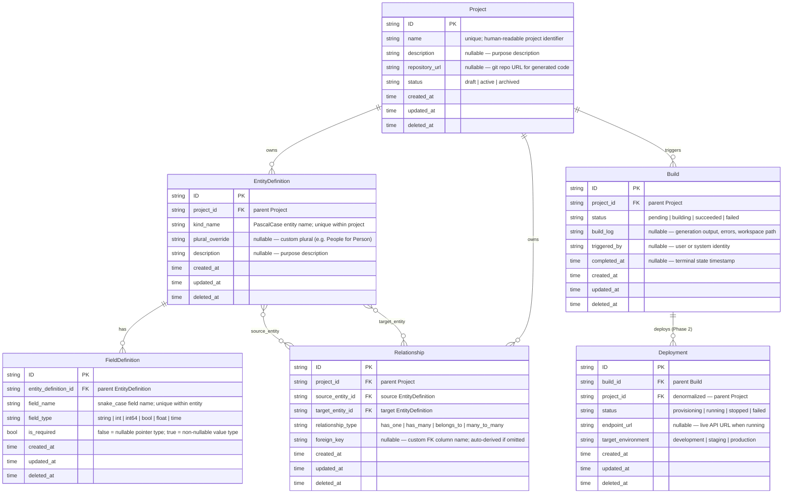

# Managed API Platform Specification

**Date:** 2026-07-07
**Status:** Draft
**ID:** APP-001
**Related:** [Entity Generator](../codegen/entity-generator.spec.md), [CLI Generator](../codegen/cli-generator.spec.md), [SDK Generator](../codegen/sdk-generator.spec.md), [Console Plugin Generator](../codegen/console-plugin-generator.spec.md), [Entity Lifecycle](../framework/entity-lifecycle.spec.md), [Event-Driven Controllers](../framework/event-driven-controllers.spec.md), [Plugin Architecture](../framework/plugin-architecture.spec.md)
**Implements:** `plugins/projects/`, `plugins/entity_definitions/`, `plugins/field_definitions/`, `plugins/relationships/`, `plugins/builds/`

---

## Overview

The Managed API Platform transforms TRex from a demonstrative "dinosaurs" API into a self-hosted API generation service. The model is intentionally layered:

- **Project** — a workspace. Groups entity definitions and provides shared context (repository URL, name) for a generated API service. The top-level aggregate.
- **EntityDefinition** — a project-scoped, mutable schema definition. Maps directly to the `--kind` argument of the entity generator. Each EntityDefinition belongs to exactly one Project.
- **FieldDefinition** — a single typed field on an EntityDefinition. Maps to individual entries in the `--fields` argument. Append-only during a Project's active lifecycle.
- **Relationship** — a foreign-key association between two EntityDefinitions in the same Project. Defines the ERD edges: has_one, has_many, belongs_to, many_to_many.
- **Build** — an immutable execution record of the generation pipeline. Created by a user trigger, processed asynchronously by the Build controller. The canonical audit trail of what was generated and whether it succeeded.

The stable address of a generated API is `{project_name}`. It holds the entity definitions, relationships, and links to the latest build.

---

## Phasing

### Phase 1 (this spec)

5 entities: Project, EntityDefinition, FieldDefinition, Relationship, Build. These cover the full ERD-definition and generation workflow.

### Phase 2 (future spec)

Deployment entity — requires defining the deployment target (containers, Kubernetes, process-per-project) and resource lifecycle management. Deferred until the Build pipeline is proven.

---

## Prerequisites — Generator Enhancements Required

The entity generator (CG-001, `scripts/generator.go`) produces ~40% of the code needed for this spec's entities. The following capabilities are **missing** and MUST be added to CG-001 (or a follow-up spec extending it) before APP-001 can be fully implemented:

| Capability | Current State | Required Enhancement |
|------------|--------------|---------------------|
| Foreign key fields | No `--parent` or `--references` flag | Add `--parent ParentKind` flag that generates a `parent_kind_id` field, DB index, and `FindByParentKindID` DAO method |
| Parent-child cascade delete | Generated delete is simple, no cascade | Generate cascade soft-delete in parent's `OnDelete` handler when `--parent` is used |
| State machine validation | Status is a plain string field | Add `--status "draft,active,archived"` flag that generates a `ValidateStatusTransition()` method and handler-layer validation |
| Filtered DAO queries | Only `Get`, `Create`, `Replace`, `Delete`, `All` | Generate `FindBy{Field}` methods for fields marked with a `:indexed` modifier |
| Uniqueness constraints | No unique constraint support | Add `:unique` field modifier that generates a DB unique index and 409 Conflict error mapping |
| Migration ordering for FK dependencies | SHA256 hash-based IDs are non-deterministic | Add `--migration-order N` flag or use topological sort based on `--parent` graph |

Until these enhancements land, the gap between generated code and the spec's requirements MUST be bridged by hand-coded post-generation customization (see [Post-Generation Customization](#post-generation-customization)).

---

## Entity Relationship Diagram



---

## Project — API Service Workspace

Project is the top-level aggregate. A Project represents a managed API service to be generated. All entity definitions, relationships, and builds are scoped to a Project.

| Field | Notes |
|-------|-------|
| `name` | Unique, human-readable. The stable identifier for this API service. Used as the `--project` flag when invoking the generator. |
| `description` | Nullable. Free-text purpose description. |
| `repository_url` | Nullable. Git repository URL where generated code is written. Used as the `--repo` flag when invoking the generator. |
| `status` | Lifecycle state machine: `draft` → `active` → `archived`. Builds can only be triggered when status is `active`. `archived` is a terminal state — no transitions out. |

**Project is mutable.** PATCH updates `name`, `description`, `repository_url`, and `status` in place. Status transitions are validated — invalid transitions (e.g. `archived` → `draft`) are rejected with 400.

**Cascade delete:** Deleting a Project soft-deletes all child EntityDefinitions (which cascade to their FieldDefinitions), Relationships, and Builds.

```
POST   /api/rh-trex-ai/v1/projects              create project (status defaults to "draft")
GET    /api/rh-trex-ai/v1/projects               list projects
GET    /api/rh-trex-ai/v1/projects/{id}          read project
PATCH  /api/rh-trex-ai/v1/projects/{id}          update project
DELETE /api/rh-trex-ai/v1/projects/{id}          soft delete (cascades to all children)
```

---

## EntityDefinition — Kind Schema Definition

EntityDefinition is scoped to a Project. Each one maps directly to a `--kind` invocation of the entity generator. The stable address within a project is `{project_name}/{kind_name}`.

| Field | Notes |
|-------|-------|
| `project_id` | FK to the parent Project. Set at creation; immutable. |
| `kind_name` | PascalCase Go identifier (e.g. "Customer", "FizzBuzz"). Unique within the project — enforced via composite DB unique index on `(project_id, kind_name)`. Validated as a valid Go exported identifier on create. |
| `plural_override` | Nullable. Custom plural form for irregular plurals (e.g. "People" for "Person", "Policies" for "Policy"). Maps to the `--plural` generator flag. When null, the generator uses its built-in pluralization. |
| `description` | Nullable. Free-text purpose description. |

**EntityDefinition is mutable.** PATCH updates `kind_name`, `plural_override`, and `description`. Changing `kind_name` after a Build has been triggered is allowed but SHOULD be avoided — it invalidates previous build artifacts.

**Cascade delete:** Deleting an EntityDefinition soft-deletes all child FieldDefinitions. Relationships referencing this entity (as source or target) are also soft-deleted.

```
POST   /api/rh-trex-ai/v1/entity_definitions                         create entity definition
GET    /api/rh-trex-ai/v1/entity_definitions                         list (supports ?project_id= filter)
GET    /api/rh-trex-ai/v1/entity_definitions/{id}                    read entity definition
PATCH  /api/rh-trex-ai/v1/entity_definitions/{id}                    update entity definition
DELETE /api/rh-trex-ai/v1/entity_definitions/{id}                    soft delete (cascades to fields + relationships)
```

---

## FieldDefinition — Typed Entity Field

FieldDefinition is scoped to an EntityDefinition. Each one maps to a single entry in the `--fields` argument of the entity generator.

| Field | Notes |
|-------|-------|
| `entity_definition_id` | FK to the parent EntityDefinition. Set at creation; immutable. |
| `field_name` | snake_case field name (e.g. "email", "max_speed", "created_by"). Unique within the entity — enforced via composite DB unique index on `(entity_definition_id, field_name)`. |
| `field_type` | One of: `string`, `int`, `int64`, `bool`, `float`, `time`. Validated at write time — invalid types are rejected with 400 listing the valid options. |
| `is_required` | Controls both Go type and OpenAPI schema. When `true`: non-nullable value type (`string`, not `*string`) and listed in the OpenAPI `required` array. When `false` or omitted: nullable pointer type (`*string`). Default: `false`. This single boolean subsumes the concept of `nullable` — there is no separate nullable field. |

**FieldDefinition is mutable.** PATCH updates `field_name`, `field_type`, and `is_required`.

**Generator mapping:** At build time, a FieldDefinition `{field_name: "email", field_type: "string", is_required: true}` maps to the generator argument `email:string:required`. A FieldDefinition `{field_name: "age", field_type: "int", is_required: false}` maps to `age:int`.

```
POST   /api/rh-trex-ai/v1/field_definitions                          create field definition
GET    /api/rh-trex-ai/v1/field_definitions                          list (supports ?entity_definition_id= filter)
GET    /api/rh-trex-ai/v1/field_definitions/{id}                     read field definition
PATCH  /api/rh-trex-ai/v1/field_definitions/{id}                     update field definition
DELETE /api/rh-trex-ai/v1/field_definitions/{id}                     soft delete
```

---

## Relationship — ERD Edge Definition

Relationship defines a foreign-key association between two EntityDefinitions in the same Project. These are the edges of the entity-relationship diagram.

| Field | Notes |
|-------|-------|
| `project_id` | FK to the parent Project. Set at creation; immutable. |
| `source_entity_id` | FK to the source EntityDefinition. Must belong to the same project as `project_id`. |
| `target_entity_id` | FK to the target EntityDefinition. Must belong to the same project as `project_id`. Must differ from `source_entity_id` — self-referencing relationships are rejected with 400. |
| `relationship_type` | One of: `has_one`, `has_many`, `belongs_to`, `many_to_many`. Validated at write time. |
| `foreign_key` | Nullable. Custom FK column name. When null, the FK is auto-derived as `{source_kind_snake_case}_id` (e.g. a `has_many` from "Customer" to "Order" generates `customer_id`). |

**Cross-entity validation:** Both `source_entity_id` and `target_entity_id` must reference EntityDefinitions belonging to the same Project (matching `project_id`). If they belong to different projects, the request is rejected with 400.

**FK auto-injection (aspirational):** When the Build controller processes relationships, a `has_many` from Customer to Order SHOULD auto-inject a `customer_id:string:required` field into Order's resolved field list. This requires the CG-001 `--parent` enhancement (see [Prerequisites](#prerequisites--generator-enhancements-required)). Until then, FK fields MUST be manually added as FieldDefinitions.

```
POST   /api/rh-trex-ai/v1/relationships                              create relationship
GET    /api/rh-trex-ai/v1/relationships                              list (supports ?project_id= filter)
GET    /api/rh-trex-ai/v1/relationships/{id}                         read relationship
PATCH  /api/rh-trex-ai/v1/relationships/{id}                         update relationship
DELETE /api/rh-trex-ai/v1/relationships/{id}                         soft delete
```

---

## Build — Generation Pipeline Execution

Build is an immutable execution record of the TRex generation pipeline. Created by a user trigger (`POST`), processed asynchronously by the Build controller's `OnUpsert` event handler. **Builds are immutable after creation** — only the Build controller MAY update `status`, `build_log`, and `completed_at`. No PATCH endpoint is exposed.

| Field | Notes |
|-------|-------|
| `project_id` | FK to the parent Project. Set at creation; immutable. |
| `status` | State machine: `pending` → `building` → `succeeded` / `failed`. Terminal states (`succeeded`, `failed`) are permanent — the controller skips processing on event replay (idempotency). |
| `build_log` | Nullable. Captures generator stdout/stderr, workspace path, and artifact references. Populated by the controller during processing. |
| `triggered_by` | Nullable. Identity of the user or system that triggered the build (e.g. "user@example.com"). Set at creation; immutable. |
| `completed_at` | Nullable. Timestamp when the build reached a terminal state. Set by the controller. |

**Build preconditions:** The parent Project MUST be in status `active`. If the Project is in `draft`, the request is rejected with 400 ("project must be active to build"). The Project MUST have at least one EntityDefinition.

### Build Controller — Subprocess Architecture

The Build controller processes pending builds asynchronously via the event-driven controller framework (FW-003). When `OnUpsert` fires for a pending Build:

```
1. Transition:  set status = "building"
2. Resolve:     load all EntityDefinitions, FieldDefinitions, and Relationships for the Project
3. Workspace:   create isolated directory under build_workspace_root (default: /tmp/trex-builds/{build_id}/)
4. Generate:    for each EntityDefinition, invoke as subprocess:
                  go run ./scripts/generator.go \
                    --kind {KindName} \
                    --fields {resolved_fields} \
                    --repo {project.repository_url} \
                    --project {project.name} \
                    --library github.com/openshift-online/rh-trex-ai
5. CLI:         invoke CLI generator (CG-002) against workspace OpenAPI spec
6. SDK:         invoke SDK generator (CG-003) against workspace OpenAPI spec
7. Success:     set status = "succeeded", completed_at = now(), build_log = workspace path + stdout
8. Failure:     set status = "failed", completed_at = now(), build_log = stderr + error details
```

The generator is a filesystem tool (`go run ./scripts/generator.go`), not a library. Subprocess invocation in an isolated workspace is the simplest correct approach. The controller captures stdout/stderr into `build_log`.

```
POST   /api/rh-trex-ai/v1/builds                                     trigger a build
GET    /api/rh-trex-ai/v1/builds                                     list (supports ?project_id= filter)
GET    /api/rh-trex-ai/v1/builds/{id}                                read build
DELETE /api/rh-trex-ai/v1/builds/{id}                                soft delete
```

Users can only trigger (POST) or cancel (DELETE) builds. No PATCH — the controller owns all status transitions.

---

## Deployment — Running Instance (Phase 2 — Future)

Deployment represents a running instance of a generated API service from a successful Build. This entity is deferred to Phase 2 pending resolution of deployment target architecture (containers, Kubernetes pods, process-per-project, etc.).

**Status:** Future — not implemented in Phase 1.

| Field | Notes |
|-------|-------|
| `build_id` | FK to the parent Build. The Build must have status `succeeded`. |
| `project_id` | FK to the parent Project. Denormalized for query efficiency — avoids joining through Build for project-scoped queries. |
| `status` | State machine: `provisioning` → `running` → `stopped` / `failed`. |
| `endpoint_url` | Nullable. Live API endpoint URL when status is `running`. |
| `target_environment` | One of: `development`, `staging`, `production`. |

---

## Generator Flag Mapping

The platform translates EntityDefinitions and FieldDefinitions into generator CLI arguments at build time.

### Field Resolution

| FieldDefinition | Generator Argument |
|-----------------|-------------------|
| `{field_name: "email", field_type: "string", is_required: true}` | `email:string:required` |
| `{field_name: "age", field_type: "int", is_required: false}` | `age:int` |
| `{field_name: "active", field_type: "bool", is_required: true}` | `active:bool:required` |
| `{field_name: "ratio", field_type: "float", is_required: false}` | `ratio:float` |
| `{field_name: "created", field_type: "time", is_required: false}` | `created:time` |

### Full Command Assembly

Given an EntityDefinition `kind_name: "Customer"` with three FieldDefinitions, the Build controller assembles:

```sh
go run ./scripts/generator.go \
  --kind Customer \
  --fields "email:string:required,age:int,active:bool:required" \
  --library github.com/openshift-online/rh-trex-ai \
  --repo github.com/myorg/my-service \
  --project my-service
```

If `plural_override` is set (e.g. "People" for "Person"), the `--plural People` flag is appended.

### Relationship-to-Field Injection (Aspirational)

When CG-001 gains `--parent` support, a `has_many` from "Customer" to "Order" will auto-inject `customer_id:string:required` into Order's resolved field list. The FK column follows the pattern `{source_kind_snake_case}_id`. Until then, FK fields must be manually added as FieldDefinitions.

---

## API Reference

### Projects

```
GET    /api/rh-trex-ai/v1/projects                                    list projects
POST   /api/rh-trex-ai/v1/projects                                    create project
GET    /api/rh-trex-ai/v1/projects/{id}                               read project
PATCH  /api/rh-trex-ai/v1/projects/{id}                               update project
DELETE /api/rh-trex-ai/v1/projects/{id}                               soft delete (cascades)
```

### Entity Definitions (Project-Scoped)

```
GET    /api/rh-trex-ai/v1/entity_definitions                          list (supports ?project_id= filter)
POST   /api/rh-trex-ai/v1/entity_definitions                          create entity definition
GET    /api/rh-trex-ai/v1/entity_definitions/{id}                     read entity definition
PATCH  /api/rh-trex-ai/v1/entity_definitions/{id}                     update entity definition
DELETE /api/rh-trex-ai/v1/entity_definitions/{id}                     soft delete (cascades to fields + relationships)
```

### Field Definitions (EntityDefinition-Scoped)

```
GET    /api/rh-trex-ai/v1/field_definitions                           list (supports ?entity_definition_id= filter)
POST   /api/rh-trex-ai/v1/field_definitions                           create field definition
GET    /api/rh-trex-ai/v1/field_definitions/{id}                      read field definition
PATCH  /api/rh-trex-ai/v1/field_definitions/{id}                      update field definition
DELETE /api/rh-trex-ai/v1/field_definitions/{id}                      soft delete
```

### Relationships (Project-Scoped)

```
GET    /api/rh-trex-ai/v1/relationships                                list (supports ?project_id= filter)
POST   /api/rh-trex-ai/v1/relationships                                create relationship
GET    /api/rh-trex-ai/v1/relationships/{id}                           read relationship
PATCH  /api/rh-trex-ai/v1/relationships/{id}                           update relationship
DELETE /api/rh-trex-ai/v1/relationships/{id}                           soft delete
```

### Builds (Project-Scoped)

```
GET    /api/rh-trex-ai/v1/builds                                       list (supports ?project_id= filter)
POST   /api/rh-trex-ai/v1/builds                                       trigger build
GET    /api/rh-trex-ai/v1/builds/{id}                                  read build
DELETE /api/rh-trex-ai/v1/builds/{id}                                  soft delete
```

No PATCH on builds — immutable after creation.

---

## CLI Reference (`trex-cli`)

The generated CLI (CG-002) will provide commands for all platform entities. These are the designed commands — implementation status tracked after generation.

### API ↔ CLI Mapping

#### Projects

| REST API | `trex-cli` Command | Status |
|---|---|---|
| `GET /projects` | `trex-cli list projects` | 🔲 planned |
| `GET /projects/{id}` | `trex-cli get project <id>` | 🔲 planned |
| `POST /projects` | `trex-cli create project --name <n> [--description <d>] [--repository-url <url>]` | 🔲 planned |
| `PATCH /projects/{id}` | `trex-cli update project <id> [--status <s>]` | 🔲 planned |
| `DELETE /projects/{id}` | `trex-cli delete project <id>` | 🔲 planned |

#### Entity Definitions

| REST API | `trex-cli` Command | Status |
|---|---|---|
| `GET /entity_definitions?project_id=` | `trex-cli list entity-definitions --project-id <p>` | 🔲 planned |
| `GET /entity_definitions/{id}` | `trex-cli get entity-definition <id>` | 🔲 planned |
| `POST /entity_definitions` | `trex-cli create entity-definition --project-id <p> --kind-name <k> [--plural-override <pl>]` | 🔲 planned |
| `PATCH /entity_definitions/{id}` | `trex-cli update entity-definition <id> [--kind-name <k>]` | 🔲 planned |
| `DELETE /entity_definitions/{id}` | `trex-cli delete entity-definition <id>` | 🔲 planned |

#### Field Definitions

| REST API | `trex-cli` Command | Status |
|---|---|---|
| `GET /field_definitions?entity_definition_id=` | `trex-cli list field-definitions --entity-definition-id <e>` | 🔲 planned |
| `POST /field_definitions` | `trex-cli create field-definition --entity-definition-id <e> --field-name <n> --field-type <t> [--required]` | 🔲 planned |
| `DELETE /field_definitions/{id}` | `trex-cli delete field-definition <id>` | 🔲 planned |

#### Relationships

| REST API | `trex-cli` Command | Status |
|---|---|---|
| `GET /relationships?project_id=` | `trex-cli list relationships --project-id <p>` | 🔲 planned |
| `POST /relationships` | `trex-cli create relationship --project-id <p> --source <s> --target <t> --type <has_many\|...>` | 🔲 planned |
| `DELETE /relationships/{id}` | `trex-cli delete relationship <id>` | 🔲 planned |

#### Builds

| REST API | `trex-cli` Command | Status |
|---|---|---|
| `GET /builds?project_id=` | `trex-cli list builds --project-id <p>` | 🔲 planned |
| `GET /builds/{id}` | `trex-cli get build <id>` | 🔲 planned |
| `POST /builds` | `trex-cli trigger build --project-id <p>` | 🔲 planned |
| `DELETE /builds/{id}` | `trex-cli delete build <id>` | 🔲 planned |

---

## Post-Generation Customization

The entity generator (CG-001) produces scaffolding for each entity. The following customizations MUST be applied manually after generation until the corresponding generator enhancements are implemented:

| Entity | Post-Generation Work | Generator Enhancement That Eliminates It |
|--------|---------------------|------------------------------------------|
| **All entities with parents** | Add `{parent}_id` foreign key field to model, DB index in migration, and `FindBy{Parent}ID()` DAO method | `--parent` flag (CG-001) |
| **Project** | Add `ValidateStatusTransition()` to service layer; reject invalid transitions in handler | `--status` flag (CG-001) |
| **Build** | Add `ValidateStatusTransition()` to service layer; reject invalid transitions in handler | `--status` flag (CG-001) |
| **Project** | Add cascade soft-delete of children in `OnDelete` handler | `--parent` cascade support (CG-001) |
| **EntityDefinition** | Add composite unique index `(project_id, kind_name)` to migration; map GORM duplicate key error to 409 | `:unique` field modifier (CG-001) |
| **FieldDefinition** | Add composite unique index `(entity_definition_id, field_name)` to migration; map GORM duplicate key error to 409 | `:unique` field modifier (CG-001) |
| **Relationship** | Add same-project validation and self-reference check in handler | Custom validation (likely always hand-coded) |
| **Build** | Implement subprocess-based generation orchestration in `OnUpsert` handler | N/A (application-specific logic) |
| **All child entities** | Add `FindBy{Parent}ID()` filtered query to DAO and expose via query parameter in handler | `:indexed` field modifier (CG-001) |

---

## Design Decisions

| Decision | Rationale |
|----------|-----------|
| 5 entities in Phase 1, Deployment deferred to Phase 2 | Deployment requires defining infrastructure targets (K8s, containers, processes) which is orthogonal to the ERD-to-generation pipeline. Ship the core loop first. |
| Build is immutable (no PATCH endpoint) | Only the controller changes Build state, ensuring a clean audit trail. Users can only trigger (POST) or cancel (DELETE) builds. |
| Build controller uses subprocess execution | The entity generator is a file-system tool (`go run ./scripts/generator.go`), not a library. Subprocess invocation in an isolated workspace directory is the simplest correct approach. The Build controller creates a temp directory, shells out, and captures stdout/stderr. |
| Separate FieldDefinition entity (not embedded JSON) | Enables individual CRUD, audit trail per field, and filtering — proves the generator handles high entity counts. |
| `is_required` subsumes `nullable` | A single `is_required` boolean controls both Go type (pointer vs value) and OpenAPI `required` array membership. No separate `nullable` field — `is_required: true` means non-nullable, `is_required: false` or omitted means nullable. Eliminates ambiguity. |
| Uniqueness enforced at DB level with error mapping | Composite unique indexes on `(project_id, kind_name)` and `(entity_definition_id, field_name)` prevent races. GORM duplicate key errors are mapped to 409 Conflict in the service layer. |
| New `app/` spec domain | Cleanly separates "what TRex does as a product" from "how TRex works as a framework". |
| Relationship auto-injection is aspirational | FK field auto-injection from Relationships requires CG-001 `--parent` support. Until then, FK fields are added as explicit FieldDefinitions. The spec documents both the target state and the interim workaround. |
| Status field as string enum (not Go enum) | Matches existing TRex pattern; validated in handler layer. |
| No self-referencing relationships | Simplifies initial implementation; MAY be added in a future spec revision. |
| Flat routes (not nested under /projects/{id}/) | TRex convention uses flat routes with query parameter filtering. Child entities use `?project_id=` or `?entity_definition_id=` filters on list endpoints rather than nested path prefixes. |

---

## Implementation Coverage Matrix

_Last updated: 2026-07-07. All items are planned — no implementation yet._

| Area | API Server | Go SDK | CLI (`trex-cli`) | Notes |
|---|---|---|---|---|
| **Projects — CRUD** | 🔲 | 🔲 | 🔲 | Status transitions, cascade delete |
| **EntityDefinitions — CRUD** | 🔲 | 🔲 | 🔲 | Unique constraint on `(project_id, kind_name)` |
| **FieldDefinitions — CRUD** | 🔲 | 🔲 | 🔲 | Unique constraint on `(entity_definition_id, field_name)` |
| **Relationships — CRUD** | 🔲 | 🔲 | 🔲 | Same-project validation, self-reference rejection |
| **Builds — trigger/status** | 🔲 | 🔲 | 🔲 | Subprocess-based generation, no PATCH |
| **Build controller — generation pipeline** | 🔲 | n/a | n/a | Resolves ERD → generator arguments → subprocess |
| **Parent-child query filtering** | 🔲 | 🔲 | 🔲 | `?project_id=`, `?entity_definition_id=` |
| **Generator flag mapping** | 🔲 | n/a | n/a | EntityDefinition + FieldDefinition → `--kind --fields` |
| **Library mode (`--library`)** | 🔲 | n/a | n/a | Downstream project generation |
| **Deployment — Phase 2** | 🔲 | 🔲 | 🔲 | Deferred pending infra target resolution |
